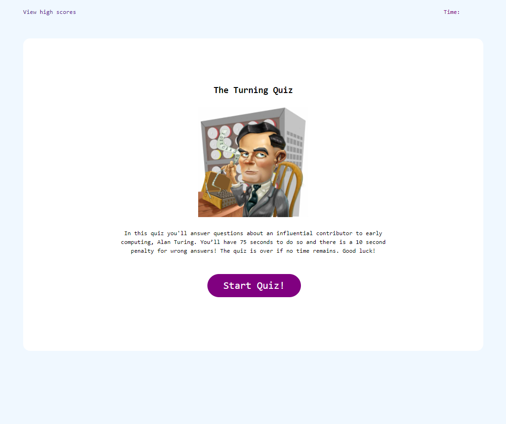

# The Turing Quiz!

## Purpose
A quiz that demonstrates working knowledge of JavaScript

## Description
In this project JavaScript techniques were taken to highlight proficiency, particularly through:
* A reactive timer
* Questions and relative incorect/correct answers stored in a JSON string
* Procedurally generated quiz questions from JSON string
* Localstorage of scores in a JSON string, including initials, ordered place, and score in time remaining

## Built With
* HTML
* CSS
* JavaScript

## Website
You can view the live deployment [HERE](https://esimondet.github.io/turing-quiz/)

## Screenshot of landing page

## Contribution
HTML, CSS, and Javascript by Edison Simondet
